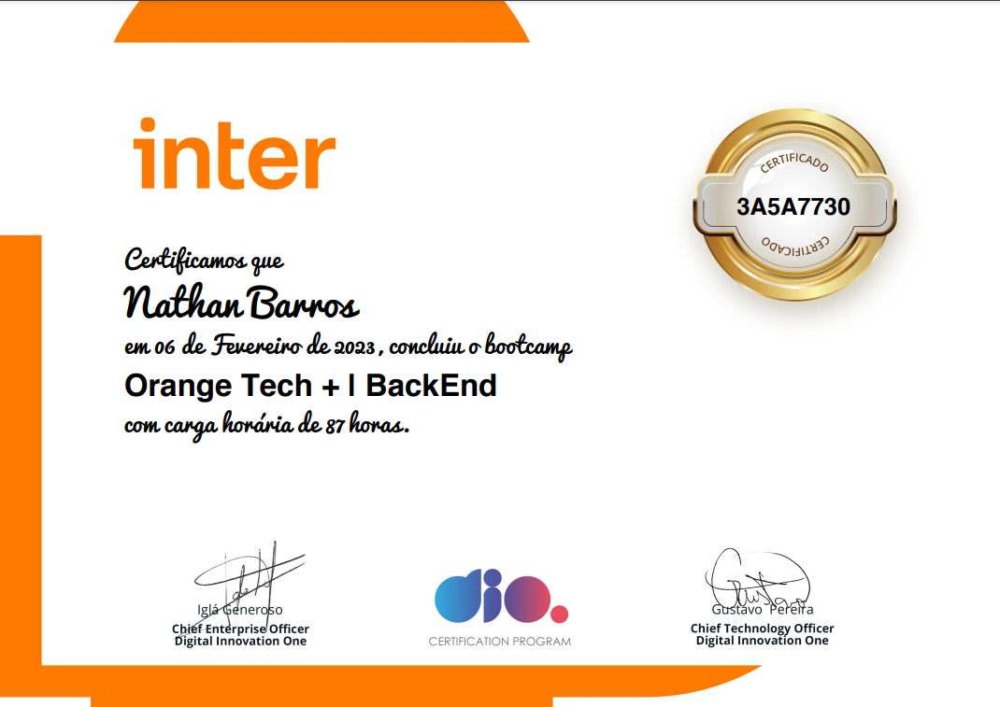

# spring-orangetech-dio
Repositório referente ao bootcamp OrangeTech+ promovido pelo banco Inter na plataforma Digital Innovation One.

Bootcamp interativo de 90 horas focado em Desenvolvimento Java Back End.

Tecnologias abordadas: Java OOP, Java Collection, Spring Boot, Lambda expressions, Maven, Stream API, dentre outras.

